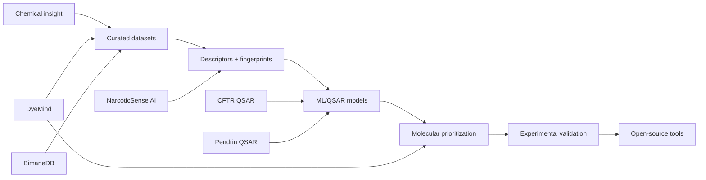

<!--
  World-class GitHub profile README for Dr. Joy Karmakar
  Upload this file as README.md inside the special profile repository:
  https://github.com/DrJoyKarmakar/DrJoyKarmakar
-->

  

  
  
  
  
  

  

<h2 align="center">Building molecular intelligence for the next era of drug discovery.</h2>

  I design <b>fluorescent probes</b>, <b>bimane-based sensors</b>, and <b>AI/ML systems</b> that help scientists move faster from molecular idea to validated discovery.

---

## Mission

I am **Dr. Joy Karmakar** — a medicinal chemist and AI researcher working at the intersection of **chemical biology, computational drug discovery, fluorescent probe design, and molecular machine learning**.

My goal is simple:

> **Democratize molecular discovery through open science, intelligent chemical databases, and AI-native research workflows.**

I build tools that turn chemistry data into decisions: QSAR pipelines, fluorophore intelligence systems, spectroscopy platforms, research organization tools, and discovery dashboards.

---

## Research operating system

<table>
<tr>
<td width="50%" valign="top">

### AI for molecules

Machine-learning workflows for molecular property prediction, ranking, QSAR modeling, and data-driven hypothesis generation.

**Focus:** RDKit · scikit-learn · XGBoost · PyTorch · cheminformatics · molecular descriptors

</td>
<td width="50%" valign="top">

### Fluorescent probe design

Bimane chemistry, responsive dyes, chemical sensors, spectral behavior, and molecular design principles for biological utility.

**Focus:** bimane probes · fluorophores · sensors · spectroscopy · chemical biology

</td>
</tr>
<tr>
<td width="50%" valign="top">

### Drug discovery pipelines

End-to-end computational medicinal chemistry pipelines connecting wet-lab intuition with screening, prioritization, and model-guided design.

**Focus:** CFTR · SLC26A transporters · ion channels · QSAR · virtual screening

</td>
<td width="50%" valign="top">

### Research productivity

AI-powered systems for organizing literature, extracting insight, building datasets, and accelerating scientific decision-making.

**Focus:** papers · Zotero · Google Drive · automation · knowledge systems

</td>
</tr>
</table>

---

## Flagship ecosystem

<table>
<tr>
<td width="33%" valign="top">

### 🧬 DyeMind

AI-powered fluorophore intelligence for probe discovery, spectral comparison, and molecular design.

<a href="https://www.dyemind.com">Explore platform →</a>

</td>
<td width="33%" valign="top">

### 🧪 BimaneDB

Open-source bimane fluorescent dye database with curated compounds and preliminary QSAR modeling.

<a href="https://github.com/drjoykarmakar/BimaneDB">View repository →</a>

</td>
<td width="33%" valign="top">

### 🛰️ NarcoticSense AI

Open-source AI platform for spectroscopy, chemometrics, analytical chemistry, and narcotic sensing research.

<a href="https://github.com/drjoykarmakar/NarcoticSense-AI">View repository →</a>

</td>
</tr>
<tr>
<td width="33%" valign="top">

### 💊 CFTR QSAR

RDKit + ML pipeline for CFTR potentiator activity prediction for cystic fibrosis medicinal chemistry.

<a href="https://github.com/drjoykarmakar/cftr-qsar">View repository →</a>

</td>
<td width="33%" valign="top">

### 🧫 Pendrin QSAR

Computational pipeline for SLC26A4 pendrin inhibitors using cheminformatics and machine learning.

<a href="https://github.com/drjoykarmakar/pendrin-qsar">View repository →</a>

</td>
<td width="33%" valign="top">

### 📚 Paper Organizer

AI-powered research-paper organizer for scientists integrating Google Drive and Zotero workflows.

<a href="https://github.com/drjoykarmakar/Paper-Organizer">View repository →</a>

</td>
</tr>
</table>

---

## Featured repositories

  
  

  
  

---

## Scientific profile

- **Medicinal chemistry**: small-molecule design, structure-activity relationships, chemical probes, sensors
- **Fluorescent probes**: bimane chemistry, spectral response, analyte sensing, dye optimization
- **AI/ML**: QSAR, molecular descriptors, model-guided discovery, chemical data systems
- **Translational discovery**: ion-channel and transporter-focused drug discovery workflows

  
  
  

---

## Technology stack

  

  
  
  
  
  

---

## Live GitHub dashboard

  
  

  

  

---

## Current build map

---

## Collaboration signal

I am open to collaborations around:

- AI for chemistry and molecular design
- Fluorescent probes and bimane-based sensors
- QSAR pipelines and drug discovery models
- Open-source scientific infrastructure
- Translational medicinal chemistry
- Research automation and literature intelligence

  
  

  

  

