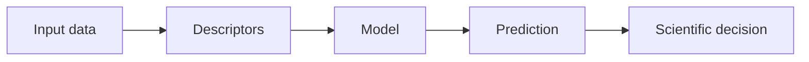

# Project Name

<p align="center">
  
</p>

<p align="center">
  
  
  
  
</p>

## What this project does

One-sentence outcome statement: **This repository helps researchers do X faster by combining Y with Z.**

## Why it matters

Explain the scientific problem, the bottleneck, and the impact of solving it.

## Key features

- Feature 1
- Feature 2
- Feature 3
- Feature 4

## Workflow



## Quick start

```bash
git clone https://github.com/drjoykarmakar/PROJECT.git
cd PROJECT
python -m venv .venv
source .venv/bin/activate
pip install -r requirements.txt
python main.py
```

## Repository structure

```text
.
├── data/
├── notebooks/
├── src/
├── results/
├── README.md
└── requirements.txt
```

## Citation

If this work helps your research, please cite the repository and related publications.

```bibtex
@software{karmakar_project_year,
  author = {Karmakar, Joy},
  title = {Project Name},
  year = {2026},
  url = {https://github.com/drjoykarmakar/PROJECT}
}
```

## Author

**Dr. Joy Karmakar**  
AI × Chemistry × Drug Discovery  
Website: https://www.joykarmakar.com
